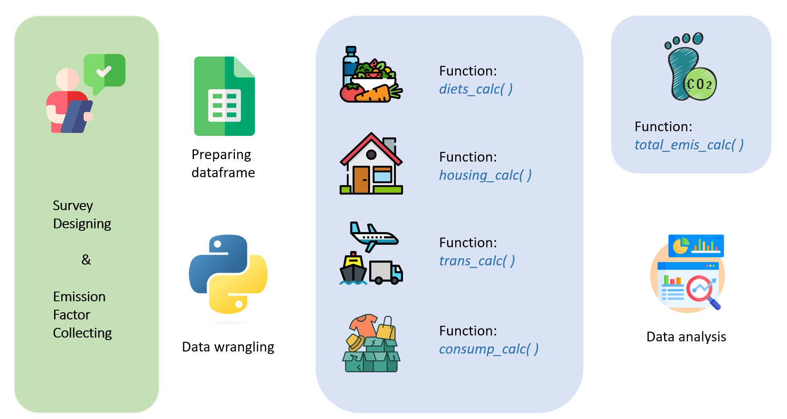

# SECFC: Survey Embedded Carbon Footprint Calculator


[](https://badge.fury.io/py/SECFC)
[](https://jinquanyescholar.netlify.app)
[](https://ziqian-xia.tech/)
[](https://x.com/yebarryallen)
[](https://x.com/Ziqian_Xia)

The SECFC (Survey Embedded Carbon Footprint Calculator) is a Python package designed to calculate the carbon footprint of individuals based on their survey responses. This tutorial will guide you through using the package to calculate carbon footprints from survey data.

## Installation

You can install the package using pip. 

```python
pip install SECFC
```

## Using SECFC
### Step 1: Import the Package
Begin by importing the necessary functions from SECFC.

```python
import pandas as pd
import numpy as np
import SECFC
from SECFC import diets_calc
from SECFC import trans_calc
from SECFC import consump_calc
from SECFC import housing_calc
from SECFC import total_emis_calc
```

### Step 2: Prepare Your Survey Data
Ensure your survey data is in a pandas DataFrame format (if you are using the Qualtrics template we provided, please ensure that the variable name are consistent). The columns should match the expected survey questions, as shown in the template below:

```python
# example usage
data = {
    'C1_Car_Usage': [5, 3, 0, 7, 2],  # Number of days using a car per week
    'C2_Car_type': [1, 2, 2, 3, 4],  # Car type code
    'C3_Travel_Distance': [2, 1, 4, 3, 2],  # Travel distance code
    'C4_Public_Transport': [3, 2, 1, 4, 0],  # Public transport frequency code
    'C5_Public_Transport_distance': [1, 2, 3, 4, 1],  # Public transport distance code
    'C5_Air_Travel': [2, 1, 1, 3, 0],  # Air travel frequency
    'C4_Public_Transport2': [3, 2, 1, 0, 4],  # Long-distance train frequency code
    'F3_Q28_1': [7, 5, 6, 2, 3],  # Number of meat meals per week
    'F3_Q28_2': [3, 4, 2, 1, 5],  # Number of vegetarian meals per week
    'F3_Q28_3': [1, 2, 3, 4, 2],  # Number of plant-based meals per week
    'F3_Q28_4': [4, 2, 5, 3, 1],  # Number of dairy meals per week
    'US_Zip_Code': [90210, 10001, 73301, 60616, 33101],  # Zip code
    'E2_Electricity_bill_1': [100, 150, 200, 250, 300],  # Monthly electricity bill
    'E3_natural_gas_bill_1': [50, 75, 100, 125, 150],  # Monthly natural gas bill
    'Family_size_6': [1, 2, 3, 4, 5],  # Number of family members 1
    'Family_size_14': [0, 1, 0, 1, 0],  # Number of family members 2
    'Family_size_15': [0, 0, 1, 0, 1],  # Number of family members 3
    'GOODS_1': [200, 300, 400, 500, 600],  # Takeout expenses
    'GOODS_2': [100, 200, 300, 400, 500],  # Dining out expenses
    'GOODS_4': [150, 250, 350, 450, 550],  # Hotel accommodation expenses
    'GOODS_5': [50, 100, 150, 200, 250],  # Tobacco products expenses
    'GOODS_6': [75, 125, 175, 225, 275],  # Alcoholic beverages expenses
    'GOODS_7': [60, 110, 160, 210, 260],  # Entertainment expenses
    'GOODS_8': [80, 130, 180, 230, 280],  # Healthcare expenses
    'PETS_1': [1, 0, 1, 0, 1],  # Number of dogs
    'PETS_2': [0, 1, 0, 1, 0],  # Number of cats
    'CL1_Q31': [1, 2, 3, 4, 5]  # Annual clothing expense level
}

```

### Step 3: Calculate Emissions
#### Transport Emissions
Calculate the carbon footprint from transportation.

```python

import SECFC
data = pd.DataFrame(data)
# data = pd.read_csv('standard data.csv')
df = SECFC.calculate_personal_emissions(df)
```

#### Food Emissions
Calculate the carbon footprint from food consumption.

```python

df = SECFC.calculate_food_emissions(df)
```

#### Housing Emissions
Calculate the carbon footprint from housing.

```python

df = SECFC.calculate_housing_emissions(df)

```

#### Consumption Emissions
Calculate the carbon footprint from living consumption.

```python
df = SECFC.calculate_consumption_emissions(df)

```

### Step 4: Calculate Total Emissions

Combine all calculated emissions to get the total carbon footprint. Optionally, you can plot the distribution of total emissions.

```python
df = SECFC.calculate_all_emissions(df, plot=True)
```

### Example Usage
Below is a complete example demonstrating how to load your data and calculate the total carbon footprint:

```python
import pandas as pd

# Load your survey data
df = pd.read_csv('data.csv')

# Calculate emissions from various categories
df = SECFC.calculate_personal_emissions(df)
df = SECFC.calculate_food_emissions(df)
df = SECFC.calculate_housing_emissions(df)
df = SECFC.calculate_consumption_emissions(df)

# Calculate total emissions and plot the distribution
df = SECFC.calculate_all_emissions(df, plot=True)

# Display the first few rows of the dataframe
print(df.head())
```

### Survey Template (provided in this repo)
Ensure your survey data is structured as follows:


C1_Car_Usage: Number of days per week using a car
C2_Car_type: Type of car used (1: Electric, 2: Hybrid, 3: Gasoline, 4: Diesel, 5: Natural gas)
C3_Travel_Distance: Code for travel distance per day (1: <5km, 2: 5-10km, 3: 10-30km, 4: >30km)
C4_Public_Transport: Frequency of public transport use (1: Daily, 2: Weekly, 3: Monthly, 4: Rarely, 5: Never)
Q74: Code for public transport travel distance per day (1: <5km, 2: 5-10km, 3: 10-30km, 4: >30km)
C5_Air_Travel: Number of flights per year
C4_Public_Transport2: Frequency of long-distance train use (1: Daily, 2: Weekly, 3: Monthly, 4: Rarely, 5: Never)
F3_Q28_1: Number of meat-based meals per week
F3_Q28_2: Number of vegan meals per week
F3_Q28_3: Number of vegetarian meals per week
F3_Q28_4: Number of dairy products consumed per week (liters)
E2_Electricity_bill_1: Monthly electricity bill (USD)
E3_natural_gas_bill_1: Monthly natural gas bill (USD)
US_Zip_Code: Zip code for location classification
Q84_1: Monthly spending on food delivery (USD)
Q84_2: Monthly spending on dining out (USD)
Q84_4: Monthly spending on hotel stays (USD)
Q84_5: Monthly spending on tobacco products (USD)
Q84_6: Monthly spending on alcoholic drinks (USD)
Q84_7: Monthly spending on entertainment (USD)
Q84_8: Monthly spending on healthcare (USD)
CL1_Q31: Annual spending on clothing (1: >600, 2: 420-600, 3: 300-420, 4: 120-300, 5: <120)
Family_size_6, Family_size_14, Family_size_15: Family size categories for calculating per capita emissions


